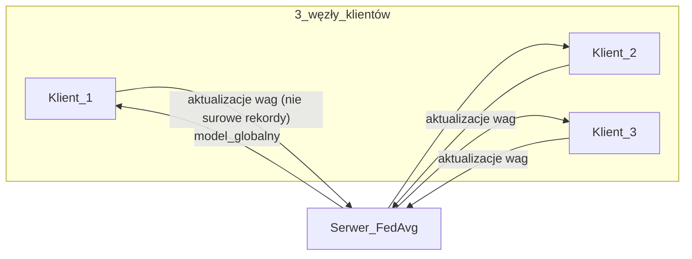
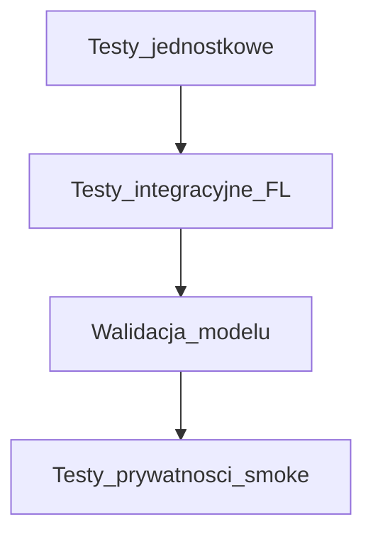

# Plan realizacji: Rozproszona detekcja anomalii (FedAvg)

## O co chodzi w projekcie (w skrócie)

Projekt z kursu **Zaawansowane Techniki Kryptografii i Kryptoanalizy** (temat 10) dotyczy **uczenia federacyjnego (FL)** do **detekcji anomalii / ataków w sieci** bez wymiany surowych danych między organizacjami.



- **Dane:** [NSL-KDD](https://www.unb.ca/cic/datasets/nsl.html) — klasyfikacja ruchu (normal vs atak, m.in. DDoS/skanowanie).
- **Architektura:** 3 niezależne „węzły” trenują **lokalne** modele ML na swoim podzbiorze danych; **serwer centralny** zbiera tylko **wagi/parametry** i wykonuje **FedAvg** (uśrednianie wag po rundach).
- **Cel badawczy:** symulacja współpracy sektorów (banki, energetyka) przy **ochronie tajemnicy przedsiębiorstwa** — wspólna detekcja zagrożeń bez centralizacji wrażliwego ruchu.
- **Kryterium sukcesu:** **F1-Score > 0.89** na modelu globalnym (po agregacji), przy założeniu że serwer **nie otrzymuje** lokalnych rekordów treningowych.

Źródło wymagań: [README.md](README.md).

---

## Sposób wykonania (architektura techniczna)

### Rekomendowany stos (zgodny z README + praktyka FL)

| Warstwa | Propozycja | Uzasadnienie |
|---------|------------|--------------|
| Język | Python 3.10+ | Standard w ML/FL |
| Model | **PyTorch** (mała sieć MLP) *lub* **scikit-learn** (np. `MLPClassifier` / logistyczna) | README dopuszcza oba; PyTorch ułatwia wieloetapowy FedAvg; sklearn szybszy na start |
| FL | **Flower (`flwr`)** *lub* minimalny własny orchestrator (skrypty + JSON wag) | Flower daje klient/serwer, rundy, logi; własny kod — pełna kontrola na prezentację algorytmu |
| Dane | `pandas`, `numpy`; jeden **wspólny pipeline** preprocessingu | Spójne kodowanie cech między klientami |
| Metryki | `sklearn.metrics` (F1, precision, recall, confusion matrix) | Kryterium F1 > 0.89 |
| Repo | `git`, struktura `src/`, `tests/`, `notebooks/` (opcjonalnie EDA) | Praca zespołowa |
| Uruchomienie | Lokalnie: 3 procesy klientów + 1 serwer *lub* `docker compose` z 4 usługami | Symulacja „rozproszenia” bez klastra |

### Przepływ pracy (end-to-end)

1. **Pobranie i czyszczenie NSL-KDD** (train + test oficjalny).
2. **Podział train na 3 zbiory klientów** (np. stratyfikacja po etykiecie ataku; dokumentacja rozkładu klas).
3. **Lokalny trening** na każdym kliencie przez N rund (epochów lokalnych).
4. **Serwer:** agregacja FedAvg: \( w_{global} = \frac{1}{3}\sum_{i=1}^{3} w_i \) (wagi proporcjonalne do liczby próbek — wariant weighted FedAvg — jeśli zbiory nierówne).
5. **Ewaluacja** modelu globalnego na **wspólnym holdout** (oficjalny test NSL-KDD lub ustalony zbiór testowy niewidziany przy podziale klientów).
6. **Raport:** threat model, opis braku przesyłu raw data, wykresy F1, porównanie z modelem trenowanym centralnie (baseline opcjonalny, nie wymagany w README).

### Decyzja do podjęcia na kickoff (15 min)

- **PyTorch + Flower** — jeśli zespół chce pokazać „prawdziwy” FL i wiele rund.
- **sklearn + własny FedAvg** — jeśli priorytetem jest szybko osiągnąć F1 i prosty kod do obrony na egzaminie.

W dokumencie [docs/PLAN_REALIZACJI.md](docs/PLAN_REALIZACJI.md) zapiszemy obie ścieżki krótko, z **jedną wybraną** po spotkaniu zespołu.

---

## Podział prac na 3 osoby (równy effort w każdym większym etapie)

Zasada: **nie dzielimy projektu na „tylko dane / tylko serwer”**. Każda osoba (**Osoba A, B, C**) ma **konkretny pakiet zadań w każdym z 4 etapów z README**, plus wspólny przegląd (PR + krótki stand-up).

Stałe przypisanie: **Osoba A = Klient 1**, **B = Klient 2**, **C = Klient 3** (symetria kodu klienta).

| Etap (README) | Osoba A | Osoba B | Osoba C | Wspólne |
|---------------|---------|---------|---------|---------|
| **1. Podział NSL-KDD** | Shard 1: eksport, statystyki klas | Shard 2 | Shard 3 | Wspólny moduł `preprocess.py`, seed, stratyfikacja; review PR wszystkich trzech |
| **2. Trening lokalny** | Implementacja/tuning klienta 1 | Klient 2 | Klient 3 | Wspólny interfejs `LocalModel`, hiperparametry uzgodnione w `config.yaml` |
| **3. FedAvg** | Test integracji klient 1 ↔ serwer | Klient 2 ↔ serwer | Klient 3 ↔ serwer | **Rotacja lead serwera:** tydzień/runda — A, B, C na zmianę „owner” merge requesta serwera (każdy musi zrozumieć agregację) |
| **4. Testy dokładności** | Metryki + wykresy dla shard 1 | Dla shard 2 | Dla shard 3 | Wspólna ewaluacja globalna na test set; jedna tabela F1 w raporcie |

**Szacowany wysiłek (orientacyjnie, do wyrównania):**

- ~25% czasu: dane + preprocessing (etap 1)
- ~30%: lokalny trening i debug (etap 2)
- ~25%: serwer + rundy FL (etap 3)
- ~20%: testy, raport, prezentacja (etap 4)

Każdy loguje **min. 1 commit** w każdym etapie (reguła zespołowa w dokumencie).

---

## Milestone’y

| ID | Milestone | Deliverable | Szacowany termin (relatywny) |
|----|-----------|-------------|------------------------------|
| M0 | Kickoff | Wybór PyTorch/Flower vs sklearn; `config.yaml`; struktura repo | T0 |
| M1 | Dane gotowe | 3 pliki/artefakty shardów + pipeline preprocessingu + README sekcja „Data” | T0 + 1 tydzień |
| M2 | Baseline lokalny | 3 modele lokalne + metryki per klient (przed FL) | + 1 tydzień |
| M3 | FedAvg działa | ≥3 rundy FL, logi wag, brak przesyłu raw data w protokole | + 1 tydzień |
| M4 | Kryterium projektu | **F1 > 0.89** na modelu globalnym; zapis wyników (`results/metrics.json`) | + 3–5 dni tuningu |
| M5 | Obrona / raport | Raport PDF/MD: threat model, FedAvg, wykresy, literatura z README | + 1 tydzień |

---

## Etapy testowania



1. **Testy jednostkowe (`pytest`)**
   - Poprawność podziału (suma próbek = train, brak przecieku testu do train klientów).
   - Funkcja `fed_avg(weights_list)` — ręczny przykład 2–3 wag.
   - Preprocessing: stała liczba cech, brak NaN po pipeline.

2. **Testy integracyjne**
   - Jedna runda FL: 3 klienty + serwer (skrypt CI lub `make test-integration`).
   - Stabilność: ten sam seed → powtarzalne F1 w tolerancji.

3. **Walidacja modelu (kryterium projektu)**
   - Oficjalny zbiór testowy NSL-KDD (lub ustalony globalny test).
   - Raport: **F1, precision, recall**, macierz pomyłek; porównanie po rundach FL (opcjonalnie wykres F1 vs runda).

4. **Testy „privacy smoke” (threat model)**
   - Asercja: payload klient→serwer zawiera **tylko** wagi/metryki, nie tablice rekordów.
   - Krótka sekcja w raporcie: co atakujący przy serwerze *może* i *nie może* zobaczyć (bez pełnego crypto — zgodnie z zakresem README).

5. **Test regresji przed oddaniem**
   - Zamrożony `results/metrics.json` lub próg F1 w teście integracyjnym (np. F1 ≥ 0.89 na CI, jeśli czas treningu na CI jest akceptowalny — inaczej test manualny + artefakt w repo).

---

## Proponowana struktura repozytorium (do utworzenia po starcie)

```
Federal-Bureau-of-Investigation/
  README.md
  docs/
    PLAN_REALIZACJI.md    # ten dokument
  data/                   # .gitignore — pobierane lokalnie
  src/
    preprocess.py
    client.py
    server.py
    model.py
    config.yaml
  tests/
    test_split.py
    test_fedavg.py
    test_integration_fl.py
  results/
  requirements.txt
```

---

## 3 skille / subagenty przydatne w tym projekcie

1. **`explore` (subagent)** — szybkie przeszukiwanie rosnącego repo (moduły klient/serwer, testy, konfiguracja) przy równoległej pracy trzech osób.
2. **`security-review` (subagent)** — przegląd pod kątem threat modelu (brak wycieku surowych danych, bezpieczny przepływ wag, surface serwera); sensowne przed M3/M5.
3. **`review-bugbot` / subagent `bugbot`** — automatyczny przegląd PR-ów (szczególnie `fed_avg`, podział danych i test integracyjny), żeby wyłapać błędy w agregacji lub przeciek testowy.

*(Opcjonalnie poza listą subagentów: skill **create-rule** — wspólne reguły Cursor dla konwencji kodu i commitów zespołu.)*

---

## Co zostanie zrobione po zatwierdzeniu planu

1. Utworzenie katalogu `docs/` (jeśli brak).
2. Zapisanie pełnej treści powyższych rozważań (po polsku, rozszerzone o sekcję „Wyjaśnienie projektu” dla osób spoza ML) w **[docs/PLAN_REALIZACJI.md](docs/PLAN_REALIZACJI.md)**.
3. **Bez** implementacji kodu FL w tej samej iteracji — unless user later requests implementation.
