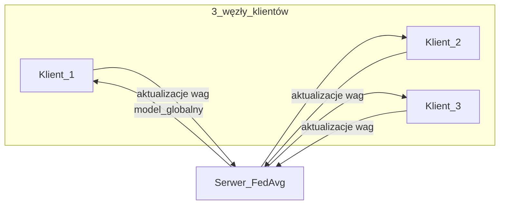
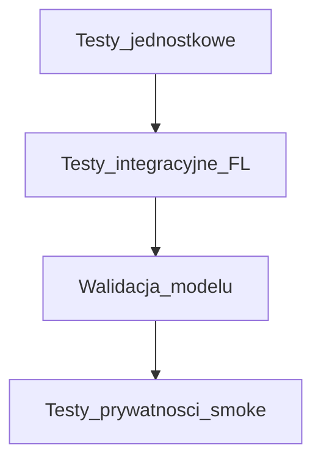

# Plan realizacji: Rozproszona detekcja anomalii (FedAvg)

Dokument dla zespołu 3-osobowego realizującego [Projekt 10](../README.md) z kursu Zaawansowane Techniki Kryptografii i Kryptoanalizy.

---

## 1. Wyjaśnienie projektu

### 1.1 Problem biznesowy i badawczy

Organizacje z sektora bankowego lub energetycznego widzą ten sam typ zagrożeń sieciowych (np. **DDoS**, **skanowanie portów**), ale nie mogą po prostu scalić swoich logów ruchu — dane są wrażliwe i objęte tajemnicą przedsiębiorstwa. Potrzebna jest **wspólna detekcja anomalii** bez centralizacji surowych rekordów.

**Uczenie federacyjne (Federated Learning, FL)** rozwiązuje to tak, że:

- każda instytucja trenuje model **lokalnie** na własnym ruchu;
- do serwera współpracy trafiają wyłącznie **aktualizacje modelu** (np. wagi sieci neuronowej), a nie paczki pakietów sieciowych;
- serwer łączy te aktualizacje algorytmem **FedAvg** (Federated Averaging) i rozsyła ulepszony model globalny z powrotem do węzłów.

W tym projekcie symulujemy **3 niezależne węzły** na zbiorze **NSL-KDD** (klasyczny benchmark detekcji intruzów w sieci). Zadanie ML: rozpoznać ruch **normalny vs atak** (w tym scenariusze zbliżone do DDoS/skanowania w ramach etykiet NSL-KDD).

### 1.2 Threat model (z README)

**Multi-tenant Privacy-Preserving Monitoring** — zakładamy, że:

- serwer koordynujący FL jest **zaufany co do protokołu**, ale **nie powinien** otrzymywać danych treningowych klientów;
- celem jest ochrona **tajemnicy przedsiębiorstwa** przy wspólnej obronie przed zagrożeniami;
- pełna ochrona przed zaawansowanymi atakami na FL (np. odwrócenie gradientu) **nie jest** wymagana w opisie projektu — skupiamy się na braku przesyłu raw data i poprawnej implementacji FedAvg.

### 1.3 Kryterium sukcesu

- **F1-Score > 0.89** dla modelu **globalnego** po agregacji FedAvg.
- Brak ujawniania **lokalnych rekordów treningowych** w kanale klient → serwer (weryfikacja w testach „privacy smoke” i w raporcie).

### 1.4 Słownik

| Skrót | Znaczenie |
|-------|-----------|
| FL | Federated Learning — uczenie bez centralizacji danych |
| FedAvg | Uśrednianie wag modeli z klientów (McMahan et al., 2017) |
| NSL-KDD | Ulepszona wersja KDD Cup 99 — cechy połączeń TCP/UDP |
| Shard | Podzbiór danych przypisany jednemu klientowi FL |

### 1.5 Architektura (schemat)



---

## 2. Sposób wykonania

### 2.1 Decyzja techniczna zespołu (kickoff)

| Opcja | Zalety | Wady |
|-------|--------|------|
| **PyTorch + Flower (`flwr`)** — **WYBRANE** | Wieloetapowe rundy FL, blisko literatury i realnych systemów; czytelny podział klient/serwer | Więcej zależności, dłuższy setup |
| scikit-learn + własny FedAvg | Szybszy prototyp, prostszy kod na obronę | Mniej naturalne wielokrotne rundy; ręczna serializacja wag |

**Uzasadnienie wyboru:** Projekt ma demonstrować **rozproszony** trening i agregację wag — Flower + PyTorch najlepiej to odzwierciedla i ułatwia rozszerzenie o kolejne rundy bez przepisywania orchestracji. sklearn pozostaje w stacku do **metryk** i ewentualnego **baseline** lokalnym.

Zespół może na kickoff potwierdzić lub przełączyć się na sklearn; wtedy aktualizujemy sekcję 2.2 i `requirements.txt`.

### 2.2 Stos narzędzi

| Warstwa | Narzędzie |
|---------|-----------|
| Język | Python 3.10+ |
| Model | PyTorch (MLP do klasyfikacji binarnej lub wieloklasowej — ustalone w `config.yaml`) |
| FL | Flower (`flwr`) |
| Dane | `pandas`, `numpy`; wspólny moduł preprocessingu |
| Metryki | `scikit-learn` (F1, precision, recall, confusion matrix) |
| Testy | `pytest` |
| Wersjonowanie | `git`, pull requesty z review co najmniej 1 osoby |
| Uruchomienie | Lokalnie: 1 proces serwera + 3 klientów; opcjonalnie `docker compose` (późniejszy etap) |

### 2.3 Przepływ end-to-end

1. Pobranie **NSL-KDD** (train + test) z [oficjalnej strony UNB](https://www.unb.ca/cic/datasets/nsl.html).
2. Wspólny preprocessing (kodowanie cech kategorycznych, skalowanie, mapowanie etykiet atak/normal).
3. Podział zbioru treningowego na **3 shardy** (stratyfikacja po klasie; ten sam `random_seed`).
4. **Rundy FL:** każdy klient trenuje lokalnie od globalnych wag → wysyła wagi → serwer wykonuje **weighted FedAvg** (wagi proporcjonalne do liczby próbek klienta).
5. Ewaluacja modelu globalnego na **oficjalnym teście NSL-KDD** (nie używany przy podziale shardów).
6. Raport końcowy: threat model, opis protokołu, wykres F1 vs runda, literatura z README.

Wzór agregacji (weighted FedAvg):

\[
w_{global} = \sum_{i=1}^{3} \frac{n_i}{n} w_i, \quad n = \sum_i n_i
\]

---

## 3. Podział prac na 3 osoby

**Zasada:** Każdy członek zespołu ma realny wkład w **każdy** z czterech etapów z README. Stałe przypisanie: **Osoba A → Klient 1**, **Osoba B → Klient 2**, **Osoba C → Klient 3**.

| Etap | Osoba A | Osoba B | Osoba C | Wspólnie |
|------|---------|---------|---------|----------|
| **1. Podział NSL-KDD** | Shard 1, statystyki klas | Shard 2 | Shard 3 | Moduł `preprocess.py`, seed, stratyfikacja; PR review |
| **2. Trening lokalny** | Klient 1 + tuning | Klient 2 | Klient 3 | Interfejs `LocalModel`, `config.yaml` |
| **3. FedAvg** | Integracja klient 1 ↔ serwer | Klient 2 ↔ serwer | Klient 3 ↔ serwer | Rotacja **lead** MR serwera: A → B → C |
| **4. Testy dokładności** | Metryki shard 1 | Shard 2 | Shard 3 | Jedna tabela F1 globalnego modelu w raporcie |

**Reguły zespołowe:**

- Minimum **1 commit na osobę** w każdym etapie (ślad w historii `git`).
- Krótki stand-up 2× w tygodniu (15 min).
- Każdy MR wymaga akceptacji **innej** osoby z zespołu.

**Szacowany rozkład czasu:**

- ~25% — dane i preprocessing
- ~30% — trening lokalny i debug
- ~25% — serwer i rundy FL
- ~20% — testy, raport, prezentacja

---

## 4. Milestone’y

| ID | Milestone | Rezultat | Termin (względny) |
|----|-----------|----------|-------------------|
| M0 | Kickoff | Potwierdzenie stosu (PyTorch+Flower), `config.yaml`, struktura repo | T0 |
| M1 | Dane | 3 shardy + pipeline + opis w README (sekcja Data) | T0 + 1 tydz. |
| M2 | Baseline lokalny | 3 modele tylko lokalne + metryki per klient | + 1 tydz. |
| M3 | FedAvg | ≥ 3 rundy FL, logi, protokół bez raw data | + 1 tydz. |
| M4 | Kryterium | **F1 > 0.89**, `results/metrics.json` | + 3–5 dni |
| M5 | Oddanie | Raport (threat model, FedAvg, wykresy, bibliografia) | + 1 tydz. |

---

## 5. Etapy testowania



### 5.1 Testy jednostkowe (`pytest`)

- Suma próbek w shardach = rozmiar train (po preprocessingu).
- Zbiór testowy NSL-KDD **nie** trafia do plików shardów treningowych.
- `fed_avg()` — przypadek z wagami znanymi z ręcznego przykładu.
- Preprocessing: stała liczba cech, brak NaN.

### 5.2 Testy integracyjne

- Jedna (lub więcej) runda FL: serwer + 3 klienty (skrypt lub `pytest` z markerem `integration`).
- Powtarzalność: ten sam seed → F1 w tolerancji (np. ±0.01) przy krótkim treningu testowym.

### 5.3 Walidacja modelu

- Ewaluacja na oficjalnym **test** NSL-KDD.
- Raport: F1, precision, recall, macierz pomyłek; opcjonalnie F1 vs numer rundy.

### 5.4 Privacy smoke

- Test/asercja: komunikat klient → serwer **nie** zawiera surowych wektorów cech w rozmiarze batcha treningowego (tylko parametry modelu).
- W raporcie: co widzi operator serwera, a czego nie widzi.

### 5.5 Regresja przed oddaniem

- Artefakt `results/metrics.json` z F1 ≥ 0.89 lub test integracyjny na małym podzbiorze z progiem zespołowym (jeśli pełny trening jest zbyt ciężki na CI).

---

## 6. Struktura repozytorium

```
Federal-Bureau-of-Investigation/
  README.md
  docs/
    PLAN_REALIZACJI.md
  data/              # lokalnie, w .gitignore
  src/
    preprocess.py
    model.py
    fedavg.py
    client.py
    server.py
    config.yaml
  tests/
    test_split.py
    test_fedavg.py
    test_integration_fl.py
  results/
  requirements.txt
  .gitignore
```

---

## 7. Skille i subagenty (Cursor) przydatne w projekcie

1. **Subagent `explore`** — szybkie odnajdywanie modułów i konwencji w repo przy równoległej pracy trzech osób.
2. **Subagent `security-review`** — przegląd przepływu danych i threat modelu przed milestone M3/M5 (wyciek raw data, powierzchnia serwera).
3. **Skill `review-bugbot` / subagent `bugbot`** — przegląd PR-ów pod kątem błędów w agregacji FedAvg, podziale train/test i testach integracyjnych.

Opcjonalnie: skill **create-rule** — wspólne reguły Cursor (styl kodu, konwencje commitów).

---

## 8. Literatura (z README)

- McMahan, B. et al. (2017). *Communication-efficient learning of deep networks from decentralized data.* AISTATS 2017.
- Tavallaee, M. et al. (2009). *A detailed analysis of the KDD CUP 99 data set.* IEEE CISDA 2009.
- PySyft / OpenMined (2024). https://github.com/OpenMined/PySyft — inspiracja dla privacy-preserving ML (nie jest wymagane w implementacji).

---

*Ostatnia aktualizacja: decyzja kickoff — PyTorch + Flower; dokument zsynchronizowany ze strukturą repozytorium.*
